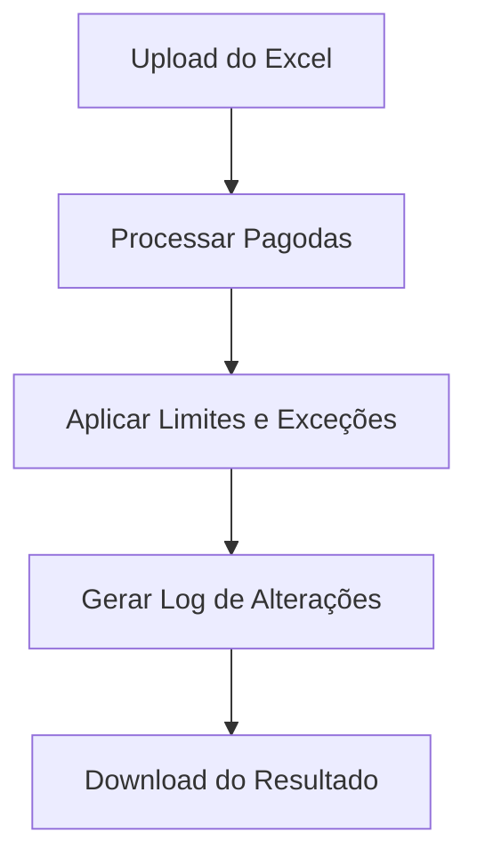

<<<<<<< HEAD
# Redistribuidor_de_Pagodas
=======
# Redistribuidor de Pagodas

Este projeto é uma aplicação em Python com interface Streamlit para redistribuição de códigos de "Pagoda" em planilhas Excel, utilizada para organização de grupos de itens (Semiacabados) conforme regras de agrupamento e limites definidos pelo usuário.

## O que o projeto faz?
- Recebe um arquivo Excel com colunas "Semiacabado" e "Pagoda".
- Redistribui os códigos de Pagoda para garantir que cada grupo tenha no máximo um número definido de itens (padrão 36, mas pode ser alterado).
- Permite exceções de limite para grupos específicos.
- Corrige buracos e quebras na sequência dos grupos.
- Gera um log das alterações realizadas.
- Permite baixar o resultado corrigido em Excel.

## Como usar
1. Execute o arquivo `app_at.py` com Streamlit:
   ```bash
   streamlit run app_at.py
   ```
2. Faça upload do arquivo Excel conforme instruções na tela.
3. Defina o limite padrão e exceções, se necessário.
4. Baixe o arquivo corrigido.

## Estrutura dos arquivos principais
- `app_at.py`: Aplicação principal Streamlit para redistribuição de Pagodas.
- `app.py` e `app_alteração.py`: Outras versões/funcionalidades relacionadas (verifique se necessário).
- Planilhas Excel: Exemplos de arquivos de entrada/saída.

## Fluxo principal (Mermaid)


---
Desenvolvido para facilitar a organização de grupos de produção em processos industriais. 
>>>>>>> aa5f856 (add algoritimo de realocação)
# Redistribuidor_de_Pagodas
